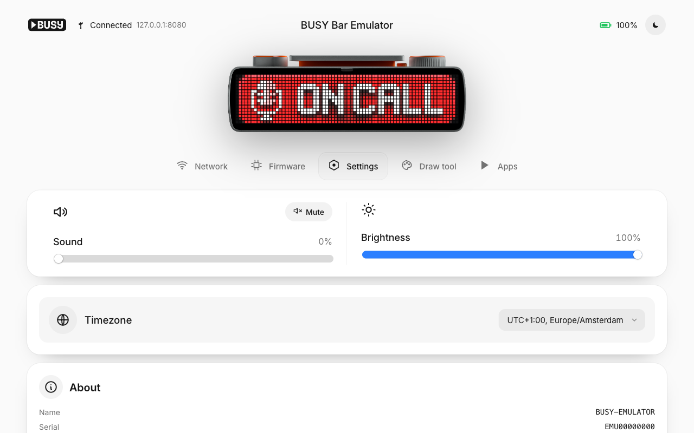

<p align="center">
  
</p>

<h1 align="center">BUSY Bar Emulator</h1>

<p align="center">
  A local emulator for the Flipper <code>BUSY Bar</code>.<br>
  Build and test display apps before your hardware arrives, using the same HTTP API, fonts, animations and pixels as the real thing.
</p>

<p align="center">
  <a href="#quick-start">Quick start</a> &middot; <a href="https://maxswinkels.github.io/busybar-apps/">Community apps</a> &middot; <a href="#the-api">API</a> &middot; <a href="docs/ATTRIBUTION.md">Attribution</a>
</p>

<p align="center">
  
  
  
  
</p>

<p align="center">
  
</p>

---

> [!TIP]
> **Run and manage BUSY Bar apps with [busybar-manager](https://github.com/maxswinkels/busybar-manager).** It's the companion app that launches, manages and monitors apps against this emulator or a real bar. The emulator is the device; busybar-manager drives it.

> [!IMPORTANT]
> **Unofficial community project.** Built and maintained by [Max Swinkels](https://github.com/maxswinkels), **not** an official Flipper Devices / BUSY product, and not affiliated with, endorsed by, or supported by them. "BUSY Bar" remains their trademark. For the real hardware and official apps, visit **[busy.app](https://busy.app)**.

## Why

- **The hardware isn't here yet.** The BUSY Bar sells out fast, so this lets you build and test apps right now instead of waiting.
- **BUSY Bar apps are just HTTP calls.** Apps target the device's REST API; the emulator implements that same API, so an app you build here runs unchanged on the real hardware. Just swap the host.
- **What works here works there.** Fonts, animations, gamma, priority and conflict resolution all match the firmware, so there are no surprises when you move to a real bar.

## Quick start

```bash
git clone https://github.com/maxswinkels/busybar-emulator.git
cd busybar-emulator/web && npm install && npm run build && cd ..
node server.js
# → http://127.0.0.1:8080
```

Then open **http://127.0.0.1:8080** and drive it: draw on the LEDs with the WYSIWYG **Draw tool**, hit the HTTP API directly, or run apps with **[busybar-manager](https://github.com/maxswinkels/busybar-manager)** (or any BUSY Bar app) pointed at the host.

> [!TIP]
> Take any real BUSY Bar app, point its host at `127.0.0.1:8080`, and it just works. The API is identical, right down to accepting `app_id`.

## Community apps

Built something cool? Share it in the [community gallery](https://maxswinkels.github.io/busybar-apps/), and browse what others made. Submit your own via pull request to [busybar-apps](https://github.com/maxswinkels/busybar-apps).

Run and manage apps with **[busybar-manager](https://github.com/maxswinkels/busybar-manager)**, the companion app that launches them against the emulator or a real bar. Every app is just HTTP calls against the device API, so pointing one at `127.0.0.1:8080` runs it exactly as it would against real hardware. The emulator itself ships no bundled apps.

## Features

- **Firmware-faithful HTTP API**: exact paths, verbs, response shapes and error codes (incl. 409 priority conflicts and `X-API-Token` auth), api_semver 25.0.0
- **Pixel-perfect text**: the device's real TTF fonts, baked to a 1-bpp glyph atlas with `lv_font_conv` using the firmware's own parameters
- **Real 72×16 animations**: all 12 status themes plus effects, imported straight from the firmware
- **Complete stock icon set**: 66 draw-tool icons, referenced exactly like the device (`faces/emoji-grinning`, `sun`, `heart`, …)
- **Authentic LED look**: square pixels, front-panel gamma (0.35) and a grayscale back OLED
- **WYSIWYG draw tool**: place text, rectangles and icons on the 72×16 grid with the device's exact fonts, pushed live to the bar
- **Web UI ported from the device**: Vue 3 frontend with the BUSY logo, device illustration and the Network / Firmware / Settings / Draw tabs

## Draw tool

Edit text, rectangles and stock icons right on the 72×16 canvas, with the same fonts and pixels as the device screen, pushed live to the bar in real time.

## Capture

The display panel has two export buttons that produce the files busybar-apps expects in an app folder:

- **PNG** — saves `preview.png` at 720×160 (72×16 LEDs × 10 px) in one click.
- **GIF** — records `preview.gif` at 20 fps for up to 30 s; click once to start, again to stop and download. Encoding is client-side (no server involved).

## The API

Success responses are `{"result":"OK"}` and errors are `{"error","code"}`. Auth mirrors the device: **localhost/USB is always allowed**; over Wi-Fi a password (set via `BUSY_API_TOKEN` or in the Network tab) is required — as `X-API-Token` for the API, or via the browser's Basic-auth prompt for the web interface. Interactive Swagger UI is served at [`/docs`](http://127.0.0.1:8080/docs) (OpenAPI spec at `/openapi.json`), just like the real bar.

```bash
curl -s -X POST localhost:8080/api/display/draw -H 'content-type: application/json' -d '{
  "application_name":"cli","priority":50,
  "elements":[{"id":"t","type":"text","text":"HELLO","x":36,"y":8,
               "font":"extra_large","align":"center","color":"#2B7FFFFF"}]}'
```

<details>
<summary>Endpoints &amp; element schema</summary>

| Method &amp; path | Purpose |
|---|---|
| `POST /api/display/draw` | Draw a frame: `{application_name, priority(1–100), elements[]}` → 409 if priority too low |
| `DELETE /api/display/draw?application_name=` | Clear (omit query to clear all) |
| `GET/POST /api/display/brightness?value=auto\|0-100` | Single brightness value |
| `POST /api/audio/play` · `DELETE /api/audio/play` · `GET/POST /api/audio/volume?volume=` | Sound |
| `POST /api/assets/upload?application_name=&file=` · `DELETE …` | PNG assets |
| `POST/GET/DELETE /api/storage/{write,read,list,mkdir,remove,rename,status}?path=` | Key/value store |
| `GET/PUT /api/busy/snapshot` · `GET/PUT /api/busy/profiles/{busy\|custom}` | BUSY timer/status |
| `GET/POST /api/name` · `GET /api/time` · `/api/time/{timestamp,timezone,tzlist}` | Device name / clock |
| `GET /api/status[/{device,firmware,system,power}]` | Nested status, `uptime` as a string |
| `GET /api/version` → `{"api_semver":"25.0.0"}` · `GET /api/transport` · `GET/POST /api/access` | Meta |
| `POST /api/input?key=` · `POST /api/log_dump` | Buttons / logs |
| `GET /api/_animations` | *(emulator)* imported-animation manifest with `fps`/`sections` |
| `GET /api/_sounds` | *(emulator)* stock-sound manifest `{name: filename}` |
| `GET /api/_scenario` | *(emulator)* scenario state: power override, offline window, steal ownership |
| `POST /api/_scenario/power` | *(emulator)* `{battery_charge?, state?}` set battery % / charging state (shown in `/api/status/power`) |
| `POST /api/_scenario/offline` | *(emulator)* `{duration_ms}` reset all non-emulator `/api/*` connections for the window; call again to restore early |
| `POST /api/_scenario/steal` | *(emulator)* `{priority?=99, duration_ms?}` draw a high-priority frame so lower-priority draws get 409 |
| `POST /api/_scenario/reset` | *(emulator)* clear all scenario overrides |
| `GET /api/_mirror` | *(emulator)* mirror config `{enabled, host, has_token, status}` (token never returned) |
| `POST /api/_mirror` | *(emulator)* `{enabled?, host?, token?}` set/save the real-bar target; omit `token` to keep the saved one, `""` clears it |
| `POST /api/_mirror/test` | *(emulator)* `{host?, token?}` probe a bar (`GET /api/version` + `/api/name`) → `{ok, api_semver?, name?, error?}`; does not persist |
| `GET /api/_netinfo` | *(emulator)* USB/Wi-Fi API URLs, token state, and Wi-Fi API access flag (HTTP API card) |
| `POST /api/_netinfo` | *(emulator)* `{wifi_api:bool}` toggle HTTP API access over Wi-Fi (localhost stays reachable) |

```jsonc
// text: colour #RRGGBBAA (default #FFFFFFFF)
{ "id":"a","type":"text","text":"BUSY","x":36,"y":8,"align":"center",
  "font":"tiny|small|normal|condensed|bold|large|extra_large|global",
  "width":62,"scroll_rate":600,"scroll_start_delay":500,"scroll_repeat_delay":1000 }

// image: path (uploaded) OR stock_path ('faces/emoji-grinning', or sun|cloud|heart|check|bolt)
{ "id":"b","type":"image","x":1,"y":0,"stock_path":"faces/emoji-grinning","opacity":100 }

// animation: a device animation folder name
{ "id":"c","type":"animation","stock_path":"coding_72x16","x":0,"y":0,"section":"default","loop":true }

// rectangle: fill none|solid|gradient_h|gradient_v
{ "id":"d","type":"rectangle","x":56,"y":9,"width":15,"height":6,
  "border_width":1,"border_color":"#FFB000FF","fill":"gradient_h","fill_colors":["#FF3C3CFF","#2B7FFFFF"] }
```

Common fields: `id` (required), `type` (required), `x`, `y`, `align` (`top_left` … `center` … `bottom_right`), `timeout` (seconds), `display_until` (unix epoch), `display` (`front`/`back`).

</details>

## Point it at real hardware

Everything you build against the emulator targets a real BUSY Bar unchanged: point your app (or [busybar-manager](https://github.com/maxswinkels/busybar-manager)) at the bar's host instead of `127.0.0.1:8080`. Same fonts, alignment, colors, scrolling, stock icons, timeouts, priority and asset uploads. It all follows the device's HTTP API.

**Or mirror to hardware while you develop.** In the **Network** tab, set your bar's host, hit **Test**, and toggle **Mirror display to hardware**. The emulator then relays every draw, clear, brightness change and asset upload to the real bar as-is (same app name + priority), so the browser preview and the LEDs render the same frame at once. Your app keeps pointing at the emulator, no `--host` change needed; forwarding is best-effort and never blocks the app. Add an API token if the bar requires one on Wi-Fi.

## Architecture

```
┌─── client apps ───┐   POST /api/display/draw    ┌── server.js (Node) ──┐   SSE   ┌── browser ──┐
│ your BUSY Bar app │  ─────────────────────────▶ │ mock BUSY Bar API +  │ ──────▶ │ LED display │
│ or the draw tool  │                             │ device state         │         │ (renderer)  │
└───────────────────┘                             └──────────────────────┘         └─────────────┘
```

`web/` is a Vite/Vue 3 frontend, built to `web/dist` and served by `server.js`. `tools/` holds the font-atlas bake process (see `tools/README.md`).

<details>
<summary>Fidelity notes</summary>

- **Rendering is a faithful approximation.** Assets decode in the browser (1 image pixel = 1 LED), the front display applies gamma 0.35, and the back OLED is grayscale. `busy_tiny` is bitmap-only and falls back to `busy_regular_5px`.
- **Priority/409 matches the firmware's core rule.** The current owner may redraw at equal priority; a different app needs strictly higher priority to take the screen (else 409). Not emulated: the real device may defer a conflicting request for up to 1.5 s, merges same-app elements by `id`, and expires elements via per-element timeouts.
- **Stubs or omitted.** Storage, audio, smart_home, wifi, update and BLE endpoints are simplified. `type:"animation"`, `/api/_animations`, `/api/_scenario*` (scenario simulator) and `/api/_mirror*` (hardware mirror) are emulator conveniences.

</details>

## Roadmap

The goal is the fastest way to build, test and show off BUSY Bar apps, with or without hardware.

**Playground &amp; testing**

- [ ] **API console**: a request builder for every `/api/*` endpoint, with live responses and replay (the draw tool, generalized)
- [x] **Scenario simulator**: trigger the conditions apps must handle, like low battery, USB/Wi-Fi drop, button presses, and a higher-priority app stealing the screen (so you can test your 409 handling)
- [ ] **Record &amp; replay**: capture an app's calls and scrub the timeline to debug animation timing

**Fidelity**

- [ ] **Screen stream (`/api/screen`)**: serve the real framebuffer so the official web app and third-party tools can target the emulator
- [ ] **Back OLED (160×80)**: render `display:"back"` elements
- [x] **Audio playback**: play stock and uploaded sounds, with a beep fallback

**SDK &amp; distribution**

- [ ] **`npx busybar-emulator`**: run with no build step, plus a Docker image
- [x] **Persistent state**: storage and uploaded assets survive restarts

**Content creation**

- [ ] **Animation editor**: build and export frame-by-frame 72×16 animations in the device format
- [x] **Copy as code**: export any draw-tool composition as a ready-to-paste `draw` payload (Python / curl / JSON)
- [ ] **Status gallery**: save, browse and re-push compositions like the device does

## Get the real thing

This is only an emulator. The BUSY Bar itself is a lovely piece of hardware built by [Flipper Devices](https://busy.app). If this project is useful to you, support the makers and grab one:

<a href="https://busy.app"><strong>busy.app →</strong></a>

## License

Code is [MIT](LICENSE). Bundled fonts, animations, icons and device artwork are © Flipper Devices, from the open-source [firmware](https://github.com/busy-app/busybar-firmware) under CC-BY 4.0 (graphics) and SIL OFL 1.1 (fonts). See [docs/ATTRIBUTION.md](docs/ATTRIBUTION.md) for the details.

"BUSY Bar" is a trademark of Flipper Devices. This project is unaffiliated and unofficial.

## Author

**Max Swinkels**
